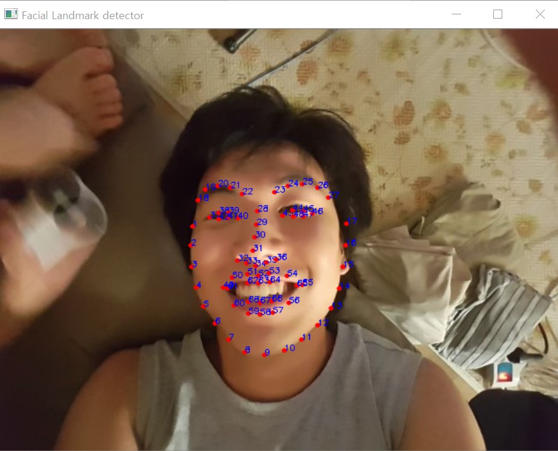
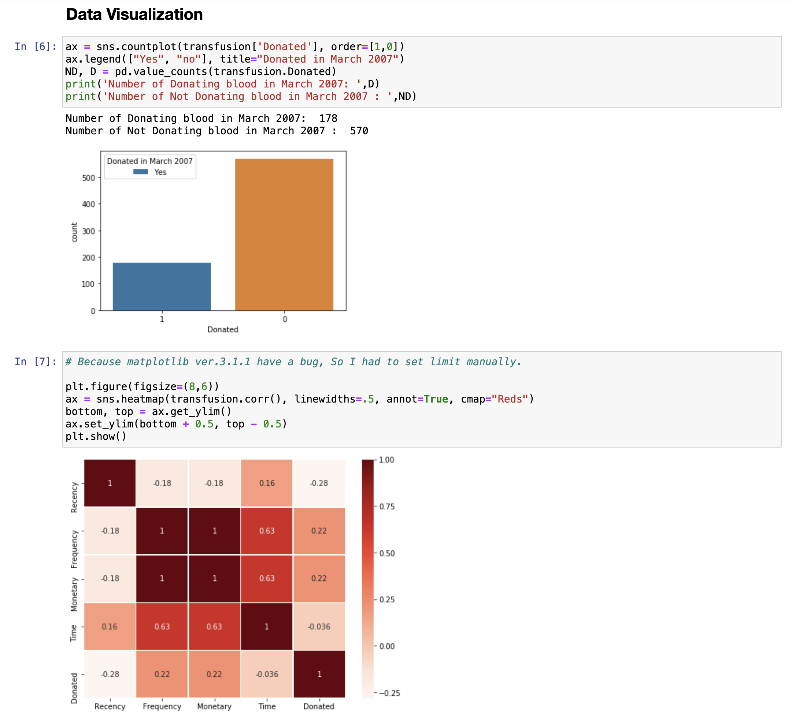
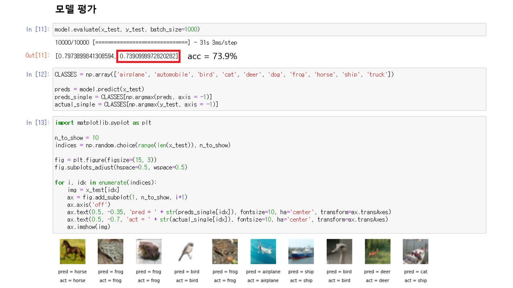
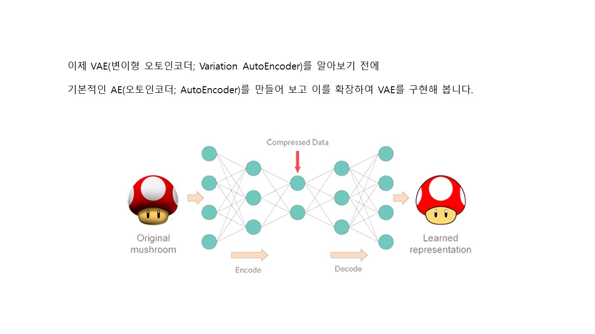
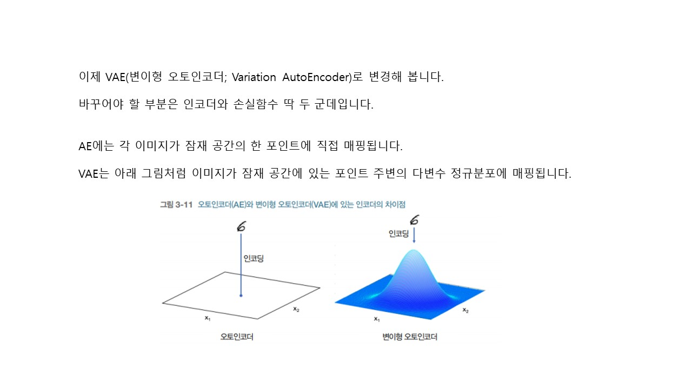
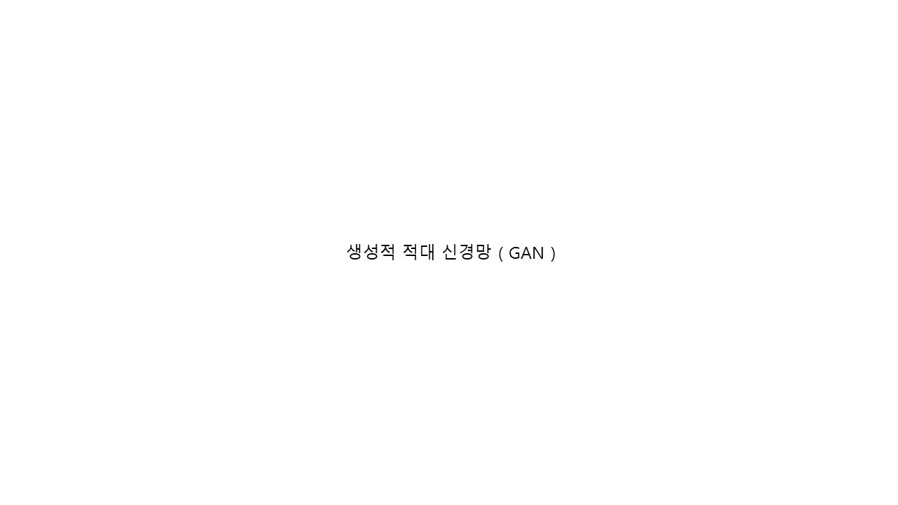
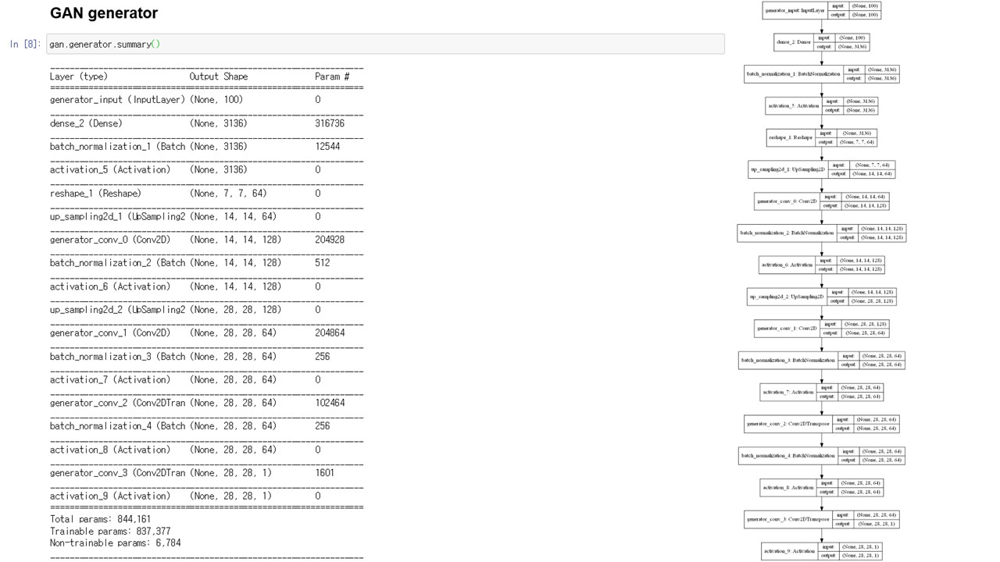
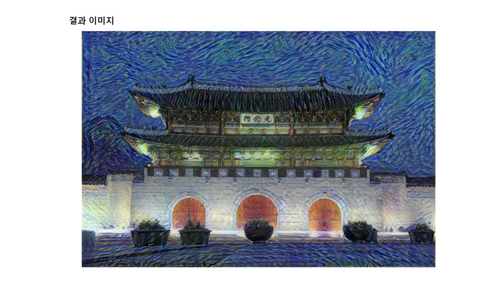
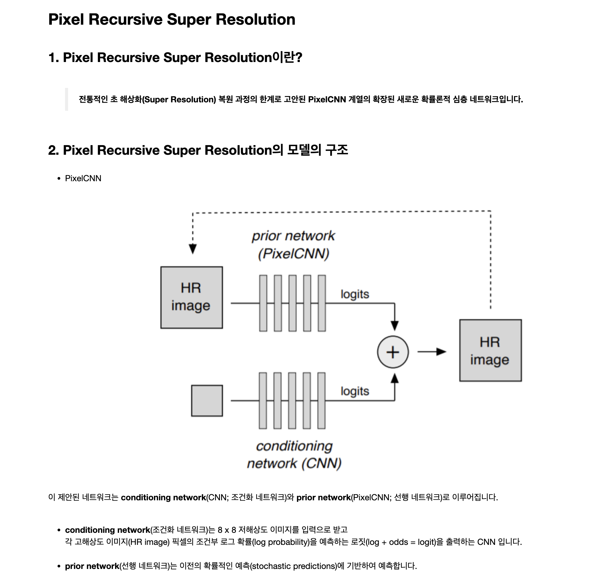

# 💧 AI-Projects

 

대학교를 다니며 수행했던 인공지능 프로젝트들을 모아두었습니다.

 

총 4개의 프로젝트로 이루어져 있습니다.

 

1. [Object_detect](https://github.com/atimaby28/AI-Projects/tree/main/Object_detect)

2. [Data_analysis](https://github.com/atimaby28/AI-Projects/tree/main/Data_analysis)

3. [Gernerative_DL](https://github.com/atimaby28/AI-Projects/tree/main/Gernerative_DL)

4. [Super_Resolution](https://github.com/atimaby28/AI-Projects/tree/main/Super_Resolution)

  
 

# 🔥 프로젝트 소개

 

 ## ❤️ Object_detect
 
  

 첫 번째 프로젝트인 < Object_detect >에는 2 가지가 있습니다.    
하나는 수산업과 인공지능을 융합하려 노력한 첫 시도이며 CNN을 사용하여 바닷 속 물고기를 탐지하는 프로젝트를 수행하였고,   
다른 하나는 cv2 라이브러리를 이용하여 얼굴을 찾아내는 프로젝트를 수행한 것이 그것입니다.    
그 당시 프로젝트 코드를 보관한다는 개념이 부족하여 코드를 갖고 있지 않습니다.   
전부 제가 짰던 코드가 아니라 대부분 오픈소스 코드를 채용하여 약간 변형하였던 프로젝트들 입니다.  

 

### 🔵 Fish Detect

   

### 🟢 Face Recognition

 

 
 
  
## 🩷 Data_analysis

 

두 번째 프로젝트인 < Data_analysis >는 인공지능프로젝트 수업시간에 수행하였으며 A+를 받은 프로젝트입니다.   
총 5개의 변수가 제공되며, 헌혈기부자가 다음에도 헌혈을 할 것인가에 대하여 예측을 하는 프로젝트입니다.   
데이터시각화 뿐만 아니라 Keras를 사용하여 기계학습 인공지능 모델을 적용하여 이진분류 후 예측을 하였습니다.

 

 
 

## 🧡 Gernerative_DL

 

< Gernerative_DL >는 교수님 연구보조 근로장학 수행활동이며 '24년 기준 다시 찾아보니   
절판된 **미술간에 GAN 딥러닝 실전 프로젝트**를 기준으로 자료를 작성하며 오류를 고치고 학습하였습니다.

 

 

 

 

 

 

 

 

 
 

## 💛 Super_Resolution

 

< Super_Resolution >은 교수님이 논문을 읽고 이 자료들도 만들어 줄 수 있냐고 여쭤보셔서 어느정도 논문을 읽고 구글 클라우드 플랫폼(GCP)를 사용하여 GPU를 돌려 수행했던 사이드 프로젝트입니다.   정식 명칭은 Pixel Recursive Super Resolution 이며 PixelCNN 모델을 사용하였습니다.   모델 자체를 전부 이해하고 구현한 것은 아니고 대부분 가져다 사용하고 짜집기식으로 교수님이 요청하신 자료를 뽑아낼 정도만 이해하였으며 그 흔적들은 Pixel-Recursive.ipynb 파일에 남겨두었습니다.   용량이 방대하여 가끔씩 열리지 않는 현상이 발생하는데, 다운받아서 확인하실 수 있습니다.

---
