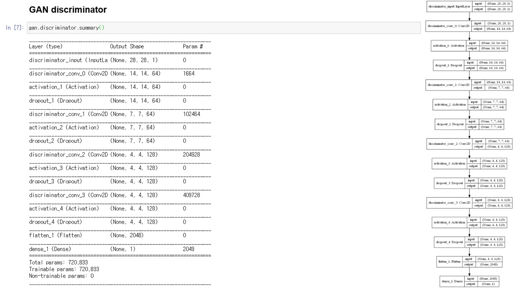

# 💧 AI-Projects

 

대학교를 다니며 수행했던 인공지능 프로젝트들을 모아두었습니다.

 

총 4개의 프로젝트로 이루어져 있습니다.

 

1. [Object_detect](https://github.com/atimaby28/AI-Projects/tree/main/Object_detect)

2. [Data_analysis](https://github.com/atimaby28/AI-Projects/tree/main/Data_analysis)

3. [Gernerative_DL](https://github.com/atimaby28/AI-Projects/tree/main/Gernerative_DL)

4. [Super_Resolution](https://github.com/atimaby28/AI-Projects/tree/main/Super_Resolution)

  
 

# 🔥 프로젝트 소개

 

 ## ❤️ Object_detect

 

### 🔵 Fish Detect

   

### 🟢 Face Recognition

 

첫 번째 프로젝트인 < Object_detect >에는 2 가지가 있습니다.    
하나는 수산업과 인공지능을 융합하려 노력한 첫 시도이며 CNN을 사용하여 바닷 속 물고기를 탐지하는 프로젝트를 수행하였고,   
다른 하나는 cv2 라이브러리를 이용하여 얼굴을 찾아내는 프로젝트를 수행한 것이 그것입니다.    
그 당시 프로젝트 코드를 보관한다는 개념이 부족하여 코드를 갖고 있지 않습니다.   
전부 제가 짰던 코드가 아니라 대부분 오픈소스 코드를 채용하여 약간 변형하였던 프로젝트들 입니다.  

 
 
  
## 🩷 Data_analysis

 

두 번째 프로젝트인 < Data_analysis >는 데이터마이닝 수업 시간에 수행하였으며 A+를 받은 수업이었습니다.   
ì´ 5개의 변수가 제공되며, 헌혈기부자가 다음에도 헌혈을 할 것인가에 대하여 예측을 하는 프로젝트입니다.   
데이터 시각화 뿐만 아니라 Keras를 사용하여 기계학습 인공지능 모델을 적용하여 이진분류 후 예측을 하였습니다.

 

 
 

## 🧡 Gernerative_DL

< Gernerative_DL >는 교수님 연구보조 근로장학 수행활동이며 '24년 기준 다시 찾아보니   
절판된 **미술간에 GAN 딥러닝 실전 프로젝트**를 기준으로 자료를 작성하며 오류를 고치고 학습하였습니다.

 

 

 

 

 

 

 

 

 
 

## 💛 Super_Resolution

 

교수님이 논문을 읽고 이 자료들도 만들어 줄 수 있냐고 여쭤보셔서 어느정도 논문을 읽고 구글 클라우드 플랫폼(GCP)를 사용하여 GPU를 돌려 수행했던 사이드 프로젝트입니다.

---
